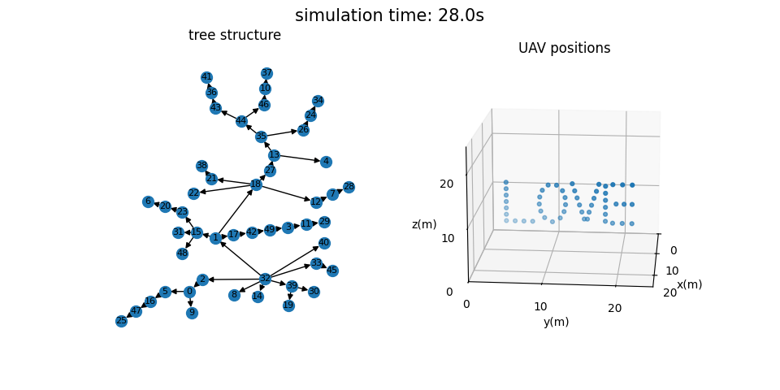

# Autonomous Hierarchical Control and Coordination of Unmanned Aerial Vehicle Swarms

Love drone shows?
Marvelled at how smart the drones are that light up your nocturnal sky with fancy patterns?
But do you know that those drones are just flying by preprogrammed routes?
They themselves are marionettes with no idea of a pattern.

However, this project creates a UAV swarm
where UAVs make real-time decisions and arrange themselves into a designated pattern.
This is achieved in two steps.
1. Before any task is received,
UAVs dynamically organsied themselves into a hierachical tree structure.
2. After a task is received which contains a designated pattern,
the pattern is split into smaller subpatterns layer by layer down the tree,
and each UAV picks up a point from its received subpattern as its target position.

Refer to the  for more details.

## About the Repository

This is a Rust workspace with two packages `astro` and `quantity`.
"astro" stands for "Autonomous Swarm Tasking Routing and Organisation".
It is the main package implementing the swarm algorithm.
`quantity` is an auxiliary package dealing with physical vector quantities.

`data` directory contains some simulation results.
`vis.py` is a python script for data visualisation.

## Usage

1. [Install the Rust environment](https://www.rust-lang.org/tools/install).
2. Clone this repo: `git clone https://github.com/NGC0001/AutoSwarm.git`.
3. Change to the cloned project directory: `cd AutoSwarm`.
4. Build the release version of `astro`: `cargo build --release --bin astro`.
5. Build simbed and run built-in demo: `cargo run --release --bin simbed -- --num-uav 10 --task-book demo_simple_line`.
6. Press `Ctrl-C` to stop running.
7. The output file is `output/out-YYYYMMDD-HHMMSS`, with each line a json object.
Here the `YYYYMMDD` is the date and `HHMMSS` is the time.
8. Visualise the `(idx+1)`-th json object: `python3 ./vis.py output/out-YYYYMMDD-HHMMSS idx`.
The visualisation needs python package `matplotlib` and `networkx`.

Note, if the number of UAVs specified by the `--num-uav` argument is too large,
the program may crash.
An empirical rule is less than two times the number of the cpu cores.

## Simulation Case

